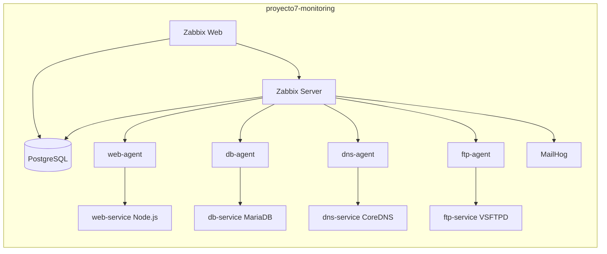

# Proyecto 7: Monitoreo de infraestructura con Zabbix

Integrantes:

- Juan Camilo Ballesteros Sierra
- Luis Felipe Murillo Matallana
- Juan Sebastian Delgado
- Daniela Castro Quinones

## Objetivo

Implementar una plataforma de monitoreo de infraestructura con Zabbix 6.x, Docker y Docker Compose. La solucion monitorea disponibilidad, servicios, metricas basicas y alertas de una red de contenedores.

Como valor agregado, el host `web-service` no es solo una pagina estatica: es una aplicacion Node.js con frontend, backend, endpoints JSON, recepcion de telemetria sintetica, persistencia en MariaDB, gestion de incidentes y rutas de carga controlada para ejecutar pruebas con Artillery.

## Arquitectura



## Inventario de hosts monitoreados

| Host en Zabbix | Servicio asociado | Check principal |
|---|---|---|
| `web-host` | `web-service` Node.js | HTTP puerto 80 |
| `db-host` | `db-service` MariaDB | TCP puerto 3306 |
| `dns-host` | `dns-service` CoreDNS | TCP puerto 53 |
| `ftp-host` | `ftp-service` VSFTPD | FTP puerto 21 |

## Requisitos

- Docker Desktop.
- Docker Compose v2.
- Python 3 para ejecutar el script de aprovisionamiento.
- PowerShell en Windows.

## Imagen Zabbix personalizada y configuracion montada

El servicio `zabbix-server` usa una imagen personalizada construida desde:

```text
docker/zabbix-server/Dockerfile
```

La imagen resultante se llama `proyecto7-zabbix-server:6.0-custom`.

Tambien se montan archivos de configuracion Zabbix como volumen:

- Servidor: `docker/zabbix-server/zabbix_server.conf.d/proyecto7.conf`
- Agentes: `zabbix-config/agent/proyecto7-agent.conf`

## Despliegue rapido

Desde esta carpeta:

```powershell
cd "C:\Users\USUARIO\Desktop\UAO 2026 SEMESTRE 1\Servicios telematicos\Proyecto7-Zabbix"
.\scripts\provision.ps1
```

Accesos:

- Zabbix Web: http://localhost:8088
- Usuario: `Admin`
- Contrasena: `zabbix`
- MailHog: http://localhost:8025

## Despliegue en VPS

El archivo `docker-compose.vps.yml` deja los servicios internos sin puertos publicos y conecta `zabbix-web` y `mailhog` a la red externa `negociocontigo_default`, para publicarlos por Caddy con HTTPS.

Accesos publicos de la demo:

- Zabbix Web: https://zabbix.negociocontigo.com
- Servicio web monitoreado: https://web-zabbix.negociocontigo.com
- Usuario: `Admin`
- Contrasena: `MonitorUAO2026!`
- MailHog: https://mailhog-zabbix.negociocontigo.com
- Usuario MailHog: `admin`
- Contrasena MailHog: `MailUAO2026!`

MailHog se publica en la VPS por medio del servicio `mailhog-gate`, que muestra una pantalla de login propia y luego reenvia el trafico al contenedor interno `mailhog:8025`.

Canal de correo real agregado:

- Alias remitente: `alertas-zabbix@negociocontigo.com`
- Buzon SMTP: `notificaciones@negociocontigo.com`
- Media type Zabbix: `Email Hostinger - Proyecto 7`
- Destino configurado: `notificaciones@negociocontigo.com`

Este canal no reemplaza MailHog. Zabbix queda enviando la misma alerta al laboratorio MailHog y al correo real del dominio para demostrar escalamiento externo.

Backend del servicio web:

- Frontend publico: `GET /`
- Salud para Zabbix: `GET /health`
- Resumen operativo: `GET /api/summary`
- Inventario JSON: `GET /api/hosts`
- Eventos de prueba: `GET /api/events`
- Reporte agregado: `GET /api/report`
- Estado de base de datos: `GET /api/db/status`
- Analitica operativa: `GET /api/analytics`
- Incidentes persistentes: `GET /api/incidents`, `POST /api/incidents`
- Telemetria sintetica: `POST /api/telemetry`
- Carga controlada: `GET /api/load/cpu`, `GET /api/load/memory`, `GET /api/load/mixed`
- Exporter de metricas: `GET /metrics`

El backend crea automaticamente tablas en `db-service`:

- `telemetry_samples`: muestras generadas desde Artillery o desde el portal.
- `incidents`: incidentes de laboratorio para demostrar escritura, consulta y persistencia.

Zabbix tambien consulta por HTTP Agent:

- Latencia HTTPS publica del portal `web-zabbix`.
- Exporter `/metrics`.
- Estado JSON de MariaDB en `/api/db/status`.

En la VPS:

```bash
cd /root/proyecto7-zabbix
docker compose -f docker-compose.vps.yml up -d --build
ZABBIX_API_URL=http://127.0.0.1:8088/api_jsonrpc.php \
ZABBIX_USER=Admin \
ZABBIX_PASSWORD='MonitorUAO2026!' \
ZABBIX_FRONTEND_URL=https://zabbix.negociocontigo.com \
MAILHOG_URL=https://mailhog-zabbix.negociocontigo.com \
python3 scripts/provision_zabbix.py
```

## Comandos utiles

Validar el Compose:

```powershell
.\scripts\verify.ps1
```

Ver estado:

```powershell
docker compose ps
```

Ver logs de Zabbix:

```powershell
docker compose logs -f zabbix-server zabbix-web
```

Detener todo:

```powershell
docker compose down
```

Borrar datos persistentes para empezar desde cero:

```powershell
docker compose down -v
```

## Aprovisionamiento de Zabbix

El script `scripts/provision_zabbix.py` crea:

- Grupo `Proyecto 7 - Infraestructura Docker`.
- Hosts `web-host`, `db-host`, `dns-host` y `ftp-host`.
- Items de disponibilidad para HTTP, MySQL, DNS y FTP.
- Triggers cuando un servicio no responde.
- Configuracion basica del media type `Email` hacia MailHog.
- Dashboard `Proyecto 7 - Monitoreo de infraestructura` con widgets de disponibilidad de hosts y problemas.

Si algun paso de correo no queda activo automaticamente, configurar manualmente:

- SMTP server: `mailhog`
- SMTP port: `1025`
- SMTP helo: `zabbix.local`
- SMTP email: `zabbix@proyecto7.local`

## Pruebas minimas esperadas

### 1. Dashboard en tiempo real

Entrar a `Monitoring > Latest data`, filtrar por el grupo `Proyecto 7 - Infraestructura Docker` y mostrar:

- CPU.
- Memoria.
- Disco.
- Estado de agente.
- Estado de HTTP, MySQL, DNS y FTP.

### 2. Simulacion de caida

```powershell
.\scripts\test-failure.ps1 -Service web-service -Seconds 90
```

Verificar en `Monitoring > Problems` que aparece el problema y luego se resuelve.

### 3. Alertas por correo

Abrir MailHog en `http://localhost:8025` y verificar que llegue la notificacion generada por el trigger.

### 4. Metricas historicas

En `Monitoring > Latest data`, abrir la grafica de un item y evidenciar datos en el tiempo.

## Pruebas de carga con Artillery

El repo incluye `tests/artillery-web-service.yml` para generar trafico real contra el sitio publico y sus endpoints de backend.

Ejecutar desde una maquina con Node.js:

```bash
npx artillery run tests/artillery-web-service.yml
```

Para una validacion rapida antes de la sustentacion:

```bash
npx artillery run tests/artillery-smoke.yml
```

La prueba cubre:

- Navegacion del frontend.
- Consulta de `/health`, `/api/summary`, `/api/hosts`, `/api/report`, `/api/db/status`, `/api/incidents` y `/api/analytics`.
- Envio de muestras a `/api/telemetry`.
- Escritura de incidentes en MariaDB con `POST /api/incidents`.
- Carga controlada sobre `/api/load/mixed`, `/api/load/cpu` y `/api/load/memory`.
- Lectura del exporter `/metrics`.

Durante la sustentacion se puede correr Artillery mientras se observa en Zabbix el comportamiento del host `web-host` y las metricas historicas.

## Demo automatizada

En la VPS se puede ejecutar una demo integral con:

```bash
cd /root/proyecto7-zabbix
bash scripts/demo-full.sh
```

El script valida endpoints publicos, muestra metricas, ejecuta Artillery smoke si `npx` esta disponible, genera carga sintetica, simula caida de `web-service`, consulta MailHog y lista las ultimas alertas de Zabbix por MailHog y SMTP real.

## Estructura

```text
Proyecto7-Zabbix/
  docker-compose.yml
  .env
  services/
    web/
      Dockerfile
      package-lock.json
      server.js
      package.json
      html/
    dns/
  tests/
    artillery-web-service.yml
  scripts/
    provision.ps1
    demo-full.sh
    provision_zabbix.py
    test-failure.ps1
    verify.ps1
  docs/
    INFORME_IEEE.md
    PRUEBAS.md
    SUSTENTACION.md
```

## Notas para la entrega

- Todo el despliegue corre en Docker Compose.
- No se instala ningun componente directamente en el host.
- Las credenciales son de laboratorio y deben cambiarse si se usa fuera del entorno academico.
- Para la sustentacion, dejar el stack levantado 10 minutos antes de presentar para tener graficas historicas.
