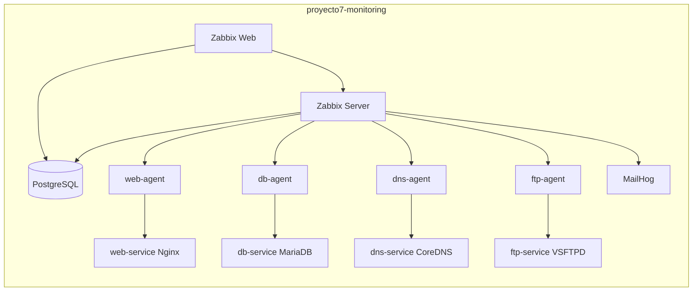

# Proyecto 7: Monitoreo de infraestructura con Zabbix

Integrantes:

- Juan Camilo Ballesteros Sierra
- Luis Felipe Murillo Matallana
- Juan Sebastian Delgado
- Daniela Castro Quinones

## Objetivo

Implementar una plataforma de monitoreo de infraestructura con Zabbix 6.x, Docker y Docker Compose. La solucion monitorea disponibilidad, servicios, metricas basicas y alertas de una red de contenedores.

## Arquitectura



## Inventario de hosts monitoreados

| Host en Zabbix | Servicio asociado | Check principal |
|---|---|---|
| `web-host` | `web-service` Nginx | HTTP puerto 80 |
| `db-host` | `db-service` MariaDB | TCP puerto 3306 |
| `dns-host` | `dns-service` CoreDNS | TCP puerto 53 |
| `ftp-host` | `ftp-service` VSFTPD | FTP puerto 21 |

## Requisitos

- Docker Desktop.
- Docker Compose v2.
- Python 3 para ejecutar el script de aprovisionamiento.
- PowerShell en Windows.

## Imagen Zabbix personalizada y configuracion montada

El servicio `zabbix-server` usa una imagen personalizada construida desde:

```text
docker/zabbix-server/Dockerfile
```

La imagen resultante se llama `proyecto7-zabbix-server:6.0-custom`.

Tambien se montan archivos de configuracion Zabbix como volumen:

- Servidor: `docker/zabbix-server/zabbix_server.conf.d/proyecto7.conf`
- Agentes: `zabbix-config/agent/proyecto7-agent.conf`

## Despliegue rapido

Desde esta carpeta:

```powershell
cd "C:\Users\USUARIO\Desktop\UAO 2026 SEMESTRE 1\Servicios telematicos\Proyecto7-Zabbix"
.\scripts\provision.ps1
```

Accesos:

- Zabbix Web: http://localhost:8088
- Usuario: `Admin`
- Contrasena: `zabbix`
- MailHog: http://localhost:8025

## Comandos utiles

Validar el Compose:

```powershell
.\scripts\verify.ps1
```

Ver estado:

```powershell
docker compose ps
```

Ver logs de Zabbix:

```powershell
docker compose logs -f zabbix-server zabbix-web
```

Detener todo:

```powershell
docker compose down
```

Borrar datos persistentes para empezar desde cero:

```powershell
docker compose down -v
```

## Aprovisionamiento de Zabbix

El script `scripts/provision_zabbix.py` crea:

- Grupo `Proyecto 7 - Infraestructura Docker`.
- Hosts `web-host`, `db-host`, `dns-host` y `ftp-host`.
- Items de disponibilidad para HTTP, MySQL, DNS y FTP.
- Triggers cuando un servicio no responde.
- Configuracion basica del media type `Email` hacia MailHog.

Si algun paso de correo no queda activo automaticamente, configurar manualmente:

- SMTP server: `mailhog`
- SMTP port: `1025`
- SMTP helo: `zabbix.local`
- SMTP email: `zabbix@proyecto7.local`

## Pruebas minimas esperadas

### 1. Dashboard en tiempo real

Entrar a `Monitoring > Latest data`, filtrar por el grupo `Proyecto 7 - Infraestructura Docker` y mostrar:

- CPU.
- Memoria.
- Disco.
- Estado de agente.
- Estado de HTTP, MySQL, DNS y FTP.

### 2. Simulacion de caida

```powershell
.\scripts\test-failure.ps1 -Service web-service -Seconds 90
```

Verificar en `Monitoring > Problems` que aparece el problema y luego se resuelve.

### 3. Alertas por correo

Abrir MailHog en `http://localhost:8025` y verificar que llegue la notificacion generada por el trigger.

### 4. Metricas historicas

En `Monitoring > Latest data`, abrir la grafica de un item y evidenciar datos en el tiempo.

## Estructura

```text
Proyecto7-Zabbix/
  docker-compose.yml
  .env
  services/
    web/
    dns/
  scripts/
    provision.ps1
    provision_zabbix.py
    test-failure.ps1
    verify.ps1
  docs/
    INFORME_IEEE.md
    PRUEBAS.md
    SUSTENTACION.md
```

## Notas para la entrega

- Todo el despliegue corre en Docker Compose.
- No se instala ningun componente directamente en el host.
- Las credenciales son de laboratorio y deben cambiarse si se usa fuera del entorno academico.
- Para la sustentacion, dejar el stack levantado 10 minutos antes de presentar para tener graficas historicas.
