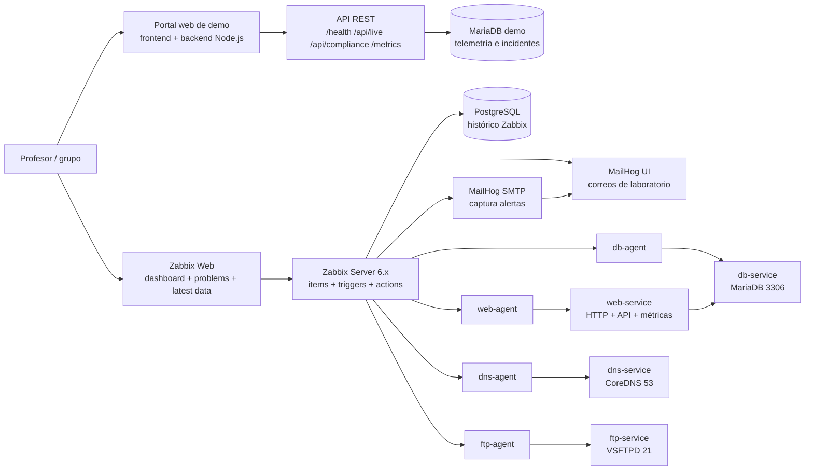
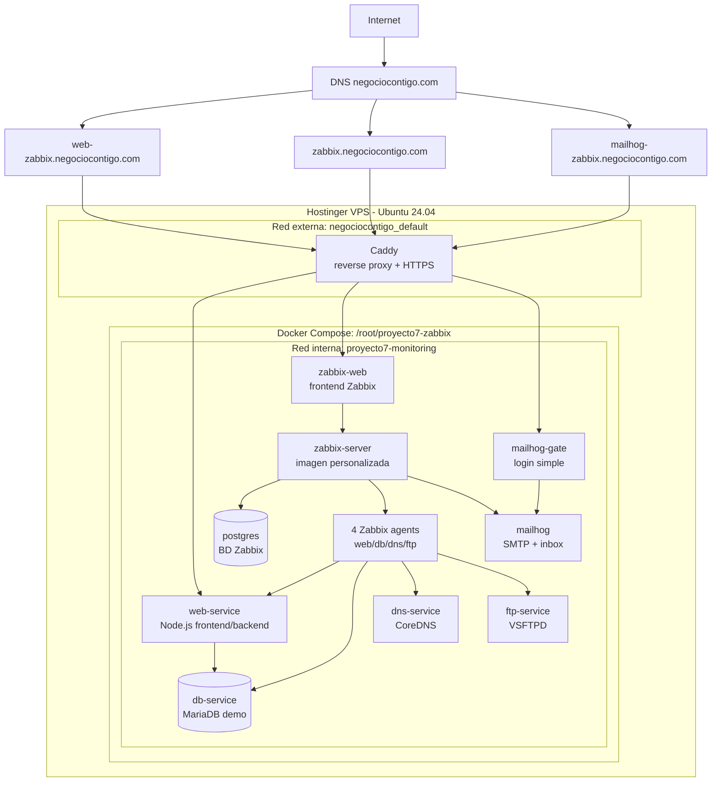

# Diagramas de arquitectura y despliegue

Este documento soporta dos preguntas típicas de sustentación:

- Arquitectura: qué componentes componen la solución y cómo se relacionan.
- Despliegue: dónde corre la solución, qué se publica a Internet y qué queda interno.

## Diagrama de arquitectura lógica

## Diagrama de despliegue en VPS

## Cómo explicarlo si el profesor pregunta

- La arquitectura lógica muestra los componentes: Zabbix, base de datos, agentes, servicios monitoreados, MailHog y portal de pruebas.
- El despliegue muestra la instalación real: una VPS Ubuntu en Hostinger, Docker Compose, redes internas y Caddy como proxy HTTPS.
- Los puertos internos no se exponen directamente a Internet. Se publican solo tres entradas HTTPS: portal web, Zabbix y MailHog.
- Zabbix Server queda en la red interna, consulta agentes y servicios, guarda histórico en PostgreSQL y envía alertas SMTP hacia MailHog.
- El portal web aporta el valor extra: backend real, MariaDB, endpoints JSON, `/metrics`, analíticas y carga con Artillery.
